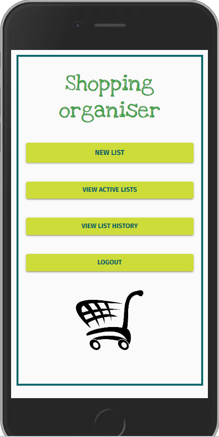
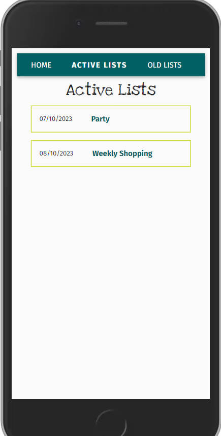
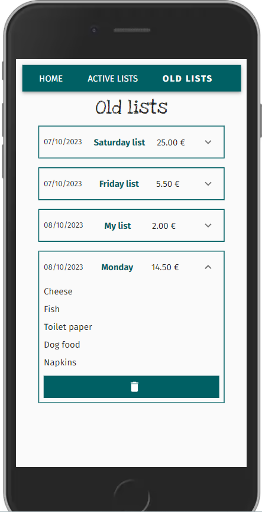
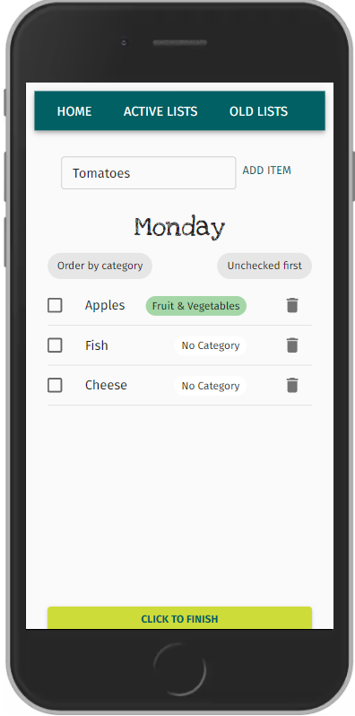
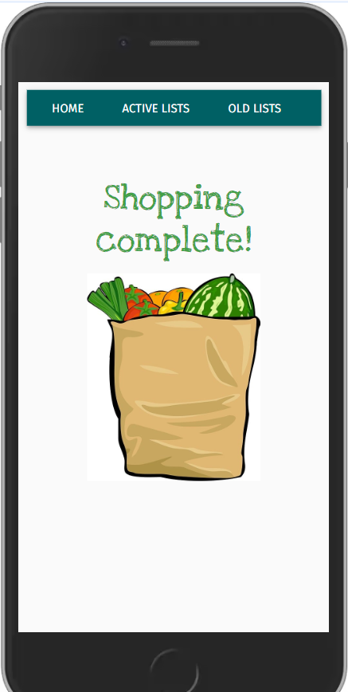
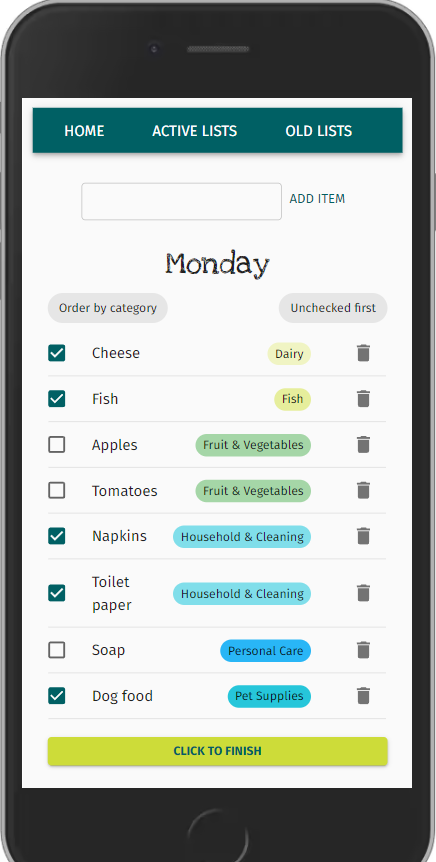
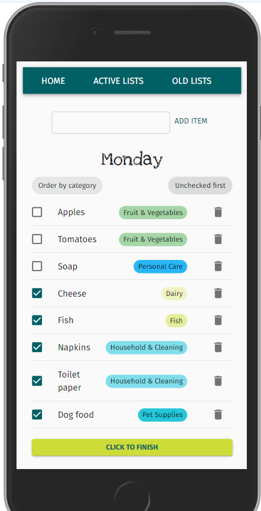
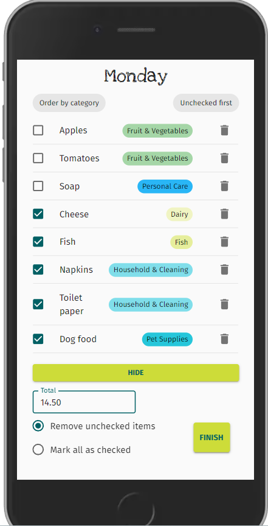

# Frontend Project "Shopping list" with React and Typescript


## 📜 Description

This is the frontend for a simple shopping list organiser app, where users can log in and create and manage a shopping list or lists. The project is a study of typescript usage and part of a full stack application. 

**The backend for the app can be found here:**

[Shoppinglist backend](https://github.com/kbastamow/Shoppinglist_back_Typescript)


## Table of contents

  - [Tech and tools](#-tech-and-tools)
  - [App](#app)
  - [Project structure](#-project-structure)
    - [Pages](#-pages)
    - [Components](#-components)
    - [Context](#-context)
    - [ Helpers](#-helpers)
    - [Types](#ts-types)
    - [Theme](#-theme)
  - [Future development](#-future-development)
  - [Author](#-author)
  - [Acknowledgements](#acknowledgements)

## 💻 Tech and tools

- React with Typescript
- Tanstack Query (formerly React Query) for data fetching and state management
- React router

✨Styles:

- Material UI

🔨 Dev:
- Eslint & prettier for linting
- React Query devtools

## 📱App


<video src="./src/assets/readme/appVideo.mp4" width=200 controls></video>


## 📂 Project structure

```
├── src
│   ├── App.css
│   ├── App.tsx
│   ├── index.css
│   ├── main.tsx
│   ├── ASSETS   
│   │
│   ├── COMPONENTS
│   │   ├── categoryTag
│   │   │   └── CategoryTag.tsx
│   │   ├── header
│   │   │   └── Header.tsx
│   │   ├── listEntry
│   │   │   └── ListEntry.tsx
│   │   ├── listWithItems
│   │   │   └── ListWithItems.tsx
│   │   ├── oldItems
│   │   │   └── OldItems.tsx
│   │   └── privateArea
│   │       └── PrivateArea.tsx
│   ├── CONTEXT
│   │   └── ItemContext.tsx
│   ├── HELPERS
│   │   ├── apiRequest.ts
│   │   ├── apiurl.ts
│   │   ├── dateConverter.ts
│   │   └── isAuthenticated.ts
│   ├── PAGES
│   │   ├── ActiveLists.tsx
│   │   ├── Home.tsx
│   │   ├── ListPage.tsx
│   │   ├── LoginPage.tsx
│   │   ├── OldLists.tsx
│   │   └── ShoppingComplete.tsx
│   ├── THEME
│   │   ├── colors.ts
│   │   └── custom.tsx
│   └── TYPES
│       ├── EnumCategory.ts
│       └── interfaces
│           ├── IAddItem.ts
│           ├── IDeleteItem.ts
│           ├── IItem.ts
│           ├── IList.ts
│           ├── IListItem.ts
│           ├── ILoginData.ts
│           ├── ILogout.ts
│           ├── INewList.ts
│           ├── INewListData.ts
│           ├── IUpdateItem.ts
│           ├── IUpdateList.ts
│           └── IUserProfile.ts
```
### 🔍 Pages

**Login**

</img>

**Homepage:**  
After login, homepage displays options to create new lists, navigate to active or old lists, or log out.

</img>

**Activelists**  
Shows lists that haven't been marked as finished yet. Shopping and editing can be continued.

</img>

**OldLists**  
Completed lists. Can be viewed or deleted.

</img>

**ListPage**  
Renders components that make up the shopping list that the user can edit in detail.

</img>

**ShoppingComplete**  
 Shows a little animation after the list is marked as completed.

</img>


### ⚙️ Components

**Header** - Simple navbar where user can move between home, active lists or old lists.

**PrivateArea** - A wrapper for pages to keep not-logged-in users out.

**OldItems** - Lists old lists with view and delete options.

**ListWithItems** - By far the longest and most complex component with queries and mutations to add, edit, delete items from a list, as well as options for finishing the shopping. 

Individual items are rendered by mapping **ListEntry** component, which in turn is responsible for rendering **CategoryTag** for each item.

The user can 
- Add, delete and edit items. 
- Add and edit categories
- Check collected items off
- Order the list by categories
- Order the list so that uncollected items appear on top

</img>

</img>

When shopping is over, the user can

- Add a total amount
- Remove unchecked items from the list
- Mark all items as checked

</img>

### 🌐 Context

The array of items for the list being edited is saved in context, as both **ListWithItems** component and **CategoryTag** component two steps down need access to it, to avoid prop drilling.

### ✋ Helpers

**ApiRequest** formats the request to backend, adding headers, authorization, and body, depending on whether the request is `GET` or something else. This way the queries and mutations in the components can be kept a little shorter.

**ApiUrl** exports the backend url in a variable.
**dateConverter** formats the date to display to user.
**isAuthenticated** is a little function to check token, and is currently only used in **Header** component.


### `ts` Types

Types is where types related to data fetching are saved. Proptypes are defined in each component when necessary.

### 🃏 Theme

Holds a custom theme for Material UI, and colour scheme for category tags.


## 🔜 Future development
The following points could be added in the future:

- [ ] Possibility for users to create their own categories
- [ ] Interface for registration
- [ ] Admin panel and tools

## ©️ Author

KBastamow

## Acknowledgements

The Shopping List full stack app was built following this [Typescript course on Udemy](https://www.udemy.com/course/typescript-course/) and uses the stack and structure of the course project. Nevertheless, the project idea and implementation are mine alone. 