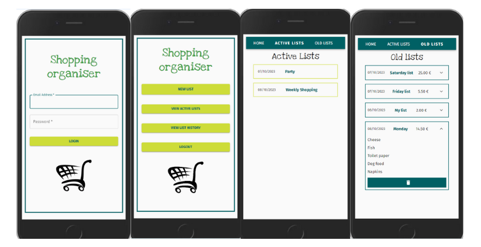
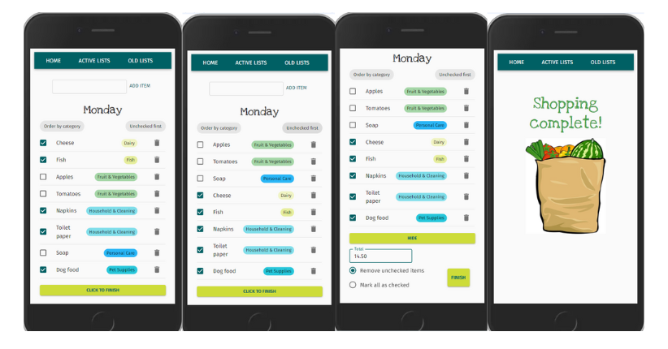

# Frontend Project "Shopping list" with React and Typescript

## Description

This is the frontend for a simple shopping list organiser app, where users can log in and create and manage a shopping list or lists. 
The project is a study of typescript usage which is why the readme contains explanations and clarifications, rather like study notes.

**The backend for the app can be found here:**


## Tech and tools

- React with Typescript
- React Query (Tanstack Query) for data fetching and state management
- React router

Styles:

- Material UI

Dev:
- Eslint & prettier for linting
- React Query devtools

## App

<video id="video" controls>
<source id="video" src="./src/assets/readme/appVideo.mp4" type="video/mp4"/>
</video>

Preview





## Project structure

```
├── src
│   ├── App.css
│   ├── App.tsx
│   ├── index.css
│   ├── main.tsx
│   ├── ASSETS   
│   │
│   ├── COMPONENTS
│   │   ├── categoryTag
│   │   │   └── CategoryTag.tsx
│   │   ├── header
│   │   │   └── Header.tsx
│   │   ├── listEntry
│   │   │   └── ListEntry.tsx
│   │   ├── listWithItems
│   │   │   └── ListWithItems.tsx
│   │   ├── oldItems
│   │   │   └── OldItems.tsx
│   │   └── privateArea
│   │       └── PrivateArea.tsx
│   ├── CONTEXT
│   │   └── ItemContext.tsx
│   ├── HELPERS
│   │   ├── apiRequest.ts
│   │   ├── apiurl.ts
│   │   ├── dateConverter.ts
│   │   └── isAuthenticated.ts
│   ├── PAGES
│   │   ├── ActiveLists.tsx
│   │   ├── Home.tsx
│   │   ├── ListPage.tsx
│   │   ├── LoginPage.tsx
│   │   ├── OldLists.tsx
│   │   └── ShoppingComplete.tsx
│   ├── THEME
│   │   ├── colors.ts
│   │   └── custom.tsx
│   └── TYPES
│       ├── EnumCategory.ts
│       └── interfaces
│           ├── IAddItem.ts
│           ├── IDeleteItem.ts
│           ├── IItem.ts
│           ├── IList.ts
│           ├── IListItem.ts
│           ├── ILoginData.ts
│           ├── ILogout.ts
│           ├── INewList.ts
│           ├── INewListData.ts
│           ├── IUpdateItem.ts
│           ├── IUpdateList.ts
│           └── IUserProfile.ts
```
### Pages
```
│   │   ├── ActiveLists.tsx
│   │   ├── Home.tsx
│   │   ├── ListPage.tsx
│   │   ├── LoginPage.tsx
│   │   ├── OldLists.tsx
│   │   └── ShoppingComplete.tsx
```

**Homepage:**  
After login, homepage displays options to create new lists, navigate to active or old lists, or logout.

**Activelists:**  
Shows lists that haven't been marked as finished yet. Shopping can be continued.

**OldLists**  
Completed lists. Can be viewed or deleted.

**ListPage**  
Renders components that make up the shopping list that the user can edit in detail.

### Components

**Header** Simple navbar where user can move between home, active lists or old lists.

**PrivateArea** a wrapper for pages to keep not-logged-in users out.

**OldItems** Lists old lists with view and delete options.

**ListWithItems** By far the longest and most complex component with queries and mutations to add, edit, delete items from a list, as well as options for finishing the shopping. Individual items are rendered by mapping **ListEntry** component, which in turn is responsible for rendering **CategoryTag** for each item.


### Context

The array of items for the list being edited is saved in context, as both **ListWithItems** component and **CategoryTag** component two steps down need access to it, to avoid prop drilling.

### Helpers

**ApiRequest** formats the request to backend, adding headers, authorization, and body, depending on whether the request is `GET` or something else. This way the queries and mutations in the components can be kept a little shorter.

**ApiUrl** exports the backend url in a variable.
**dateConverter** formats the date to display to user.
**isAuthenticated** is a little function to check token, and is currently only used in **Header** component.


### Types

Types is where data types are saved. Proptypes are defined in each component.

### Theme

Holds a custom theme for Material UI, and colour scheme for category tags.
